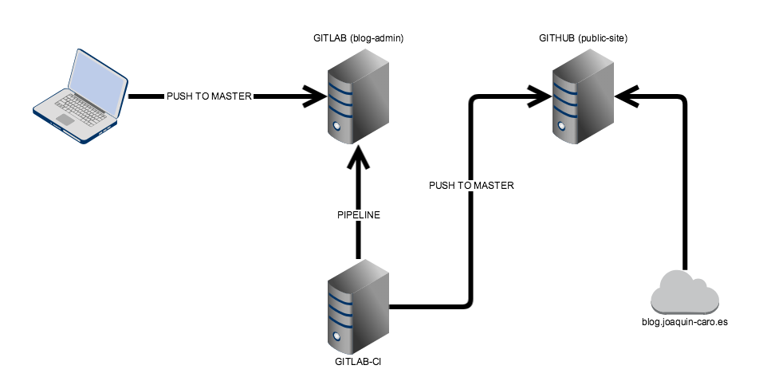

Uno de los objetivos de tener este blog es poder tener un registro de todo lo que voy aprendiendo y poniendo en practica en mi día a día.

Con el objetivo de darle un pequeño empujón al blog, apunté una lista de TODOs que podría aplicar para que me resultara más sencillo añadir contenido.

A parte de tener algo que contar, que esto al fin y al cabo es lo más complicado, otra de las tareas que me salieron era mejorar el proceso de publicar los artículos.

Hasta ahora el proceso era el siguiente:

* Crear un nuevo post con el cli que trae hugo ```hugo new post/nombre_del_articulo```
* Escribir el articulo en draft e ir revisándolo en local con otro comando del cli ```hugo serve -D```
* Una vez que finalizado el articulo, quitarle el estado draft y publicar el site en local en la carpeta public ```hugo```
* Una vez creada la carpeta public, esta commitearla y pushearla al repo de github enlazado con github pages

Con estos pasos ya tenia el nuevo articulo publicado, pero lo más tedioso de este proceso era tener la parte publica en un repo 'Carpeta public' y la parte privada en otro repo, en este caso uno privado de gitLab.

Mantener dos repos con sus respectivos commits, pushs etc, me resultaba un poco excesivo, lo único que quería era tener una aparte privada y que la publicación de la publica fuera automática.

Pensando un poco, al tener la parte privada en gitLab y gitLab ofrecer una CI para los proyectos hospedados en gitLab, se me ocurrió crearme una pipeline que en cada push a master me generara la parte publica y la pusheara al repo de github enlazado a github pages, pues manos a la obra!.

Lo primero que quería hacer es tener todo el cli de hugo dockerizado, para poder hacer las pruebas en local y ademas sería el docker que usaría la CI para la generación del site.

```Dockerfile
FROM alpine:latest

MAINTAINER JoaquinCaro <me@joaquin-caro.es>

RUN apk add --no-cache \
    curl \
    git \
    openssh-client \
    rsync

ENV VERSION 0.48
RUN mkdir -p /usr/local/src \
    && cd /usr/local/src \

    && curl -L https://github.com/gohugoio/hugo/releases/download/v${VERSION}/hugo_${VERSION}_linux-64bit.tar.gz | tar -xz \
    && mv hugo /usr/local/bin/hugo \

    && addgroup -Sg 1000 hugo \
    && adduser -SG hugo -u 1000 -h /src hugo

WORKDIR /src
```
Basicamente, me baso en un alpine y me descargo la version de Hugo de su site y lo meto en el path

y pusheo la imagen a [dockerHub](https://hub.docker.com/r/jcaromiq/hugocms/)

una vez tengo ya la imagen base para la CI, toca configurar gitLab-CI con su fichero que gitlab-ci.yml

```Yml
build:
  stage: build
  before_script:
    - git submodule update --init
    - 'which ssh-agent || ( apt-get update -y && apt-get install openssh-client -y )'
    - eval $(ssh-agent -s)
    - mkdir -p ~/.ssh
    - echo "$PRIVATE_KEY" | tr -d '\r' > ~/.ssh/id_rsa && chmod 600 ~/.ssh/id_rsa
    - ssh-keyscan -t rsa github.com >> ~/.ssh/known_hosts
    - ssh-add -k ~/.ssh/id_rsa
    - git config --global user.name "Joaquin Caro" && git config --global user.email me@joaquin-caro.es
    - git clone git@github.com:jcaromiq/jcaromiq.github.io.git public
  script:
    - hugo -v
  after_script:
    - export GIT_LOG_MESSAGE=`git log --format=%B -n 1 $CI_BUILD_REF`
    - cd public
    - git add . && git commit -am "$GIT_LOG_MESSAGE" && git push -u origin master
  only:
    - master
```

Con lo que básicamente le estoy diciendo que escuche los cambios en master y se baje el site público que tengo en [github](https://github.com/jcaromiq/jcaromiq.github.io) en el directorio public y lance el comando hugo para que me genere un site con los cambios del repo privado de gitLab.

Una vez generado el public, le hago un push con el commit message del último commit del repo privado.
Para que gitLab pueda conectar con github, se tiene que generar una clave privada y compartirla.

En el caso que vaya pusheando los cambios de los artículos en draft al repo privado, al generar el site, como no detecta cambios, no lo pushearía al repo publico.

Con esto ahora mi flujo de trabajo es algo más sencillo y solo manejo el repositorio privado, en el momento que hago push de artículos no draft, salta la pipeline de gitLab-CI y automáticamente se pública en el site.

Más o menos en un diagrama quedaría así:



